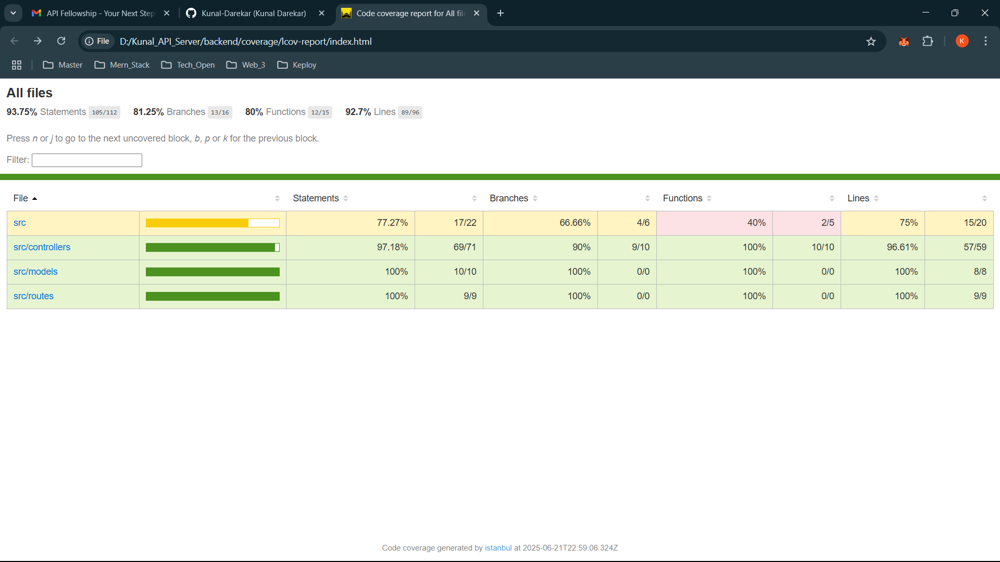
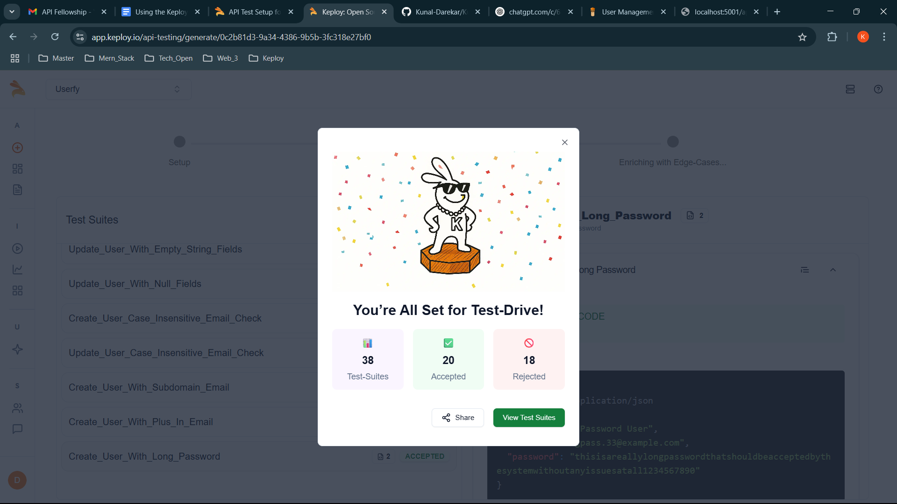
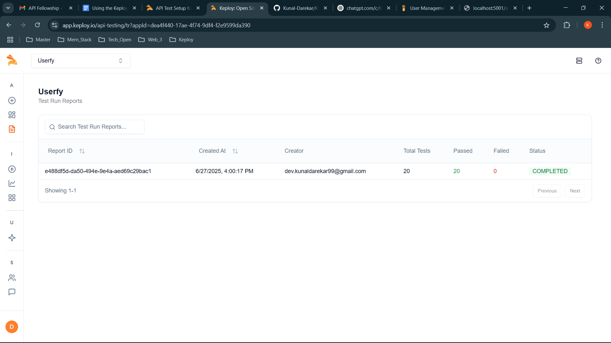

# Kunal API Server

A full-stack user management application built with TypeScript, React, Node.js, and SQLite.

## Application Screenshots

### User Interface


### Test Coverage


## Features

- 🚀 Modern TypeScript/React frontend
- 🔒 Secure user authentication
- 📱 Responsive Material Design UI
- 🎯 RESTful API endpoints
- 🗄️ SQLite database with TypeORM
- ✨ CRUD operations for user management
- 🧪 Comprehensive test suite (93.75% coverage)
- 🛡️ Type-safe codebase
- 🔄 Real-time form validation
- 📊 Detailed error handling

## Project Structure

```
kunal-api-server/
├── frontend/          # React TypeScript frontend
├── backend/           # Node.js TypeScript backend
│   ├── src/          # Source code
│   │   ├── __tests__/     # Test suites (46 tests)
│   │   ├── controllers/   # Request handlers
│   │   ├── models/       # Data models
│   │   └── routes/       # API routes
│   └── coverage/     # Test coverage reports
├── assets/           # Project assets and images
├── README.md         # Main documentation
└── API_DOCUMENTATION.md # API endpoints documentation
```

## Test Coverage

The project features comprehensive test coverage across all components, ensuring reliability and robustness. The tests cover all API endpoints, database operations, and application configuration.


### Test Types

1. **API Tests** (`userApi.test.ts`)
   - End-to-end testing of HTTP endpoints
   - Tests all CRUD operations via HTTP
   - Validates response status codes and bodies
   - Tests error handling and edge cases
   - 8+ test cases covering all API endpoints

2. **Unit Tests** (`userController.test.ts`)
   - Isolated testing of controller functions
   - Extensive mocking of TypeORM repositories
   - Tests success and error scenarios
   - Validates input handling and data validation
   - 25+ test cases for all CRUD operations

3. **Integration Tests** (`userIntegration.test.ts`)
   - Tests database operations with in-memory SQLite
   - Validates data persistence and constraints
   - Tests TypeORM repository operations
   - Verifies data integrity and relationships
   - 6+ test cases for database operations

4. **Configuration Tests** (`app.test.ts`)
   - Tests Express middleware configuration
   - Validates database initialization
   - Tests environment-specific settings
   - Verifies CORS and JSON parsing
   - 7+ test cases for app setup

### Running Tests

From the backend directory:

```bash
# Run all tests
npm test

# Run tests with coverage report
npm run test:coverage

# View the coverage report
open coverage/lcov-report/index.html
```

### Testing Tools
- **Jest**: Main testing framework
- **Supertest**: HTTP assertions
- **SQLite**: In-memory database for testing
- **TypeORM**: Database operations testing
- **ts-jest**: TypeScript support

### Testing Strategy
- Uses in-memory SQLite database for tests
- Isolates tests with database clearing between runs
- Mocks external dependencies in unit tests
- Validates both success and error scenarios
- Tests all API endpoints and database operations
- Ensures type safety with TypeScript

The detailed coverage report can be viewed by opening `backend/coverage/lcov-report/index.html` after running the tests.

## Prerequisites

- Node.js (v14 or higher)
- npm or yarn
- TypeScript

## Quick Start

1. Clone the repository:
   ```bash
   git clone https://github.com/Kunal-Darekar/Kunal_API_Server
   cd kunal-api-server
   ```

2. Start the backend:
   ```bash
   cd backend
   npm install
   npm start
   ```

3. Start the frontend:
   ```bash
   cd frontend
   npm install
   npm start
   ```

4. Open [http://localhost:3000](http://localhost:3000) in your browser

## Running Tests

### Backend Tests
```bash
cd backend
npm test          # Run tests
npm run test:coverage  # Run tests with coverage report
```


## Environment Variables

### Backend
- `PORT`: Server port (default: http://localhost:5001/api/users)
- `NODE_ENV`: Environment ('development' | 'test' | 'production')

### Frontend
- `REACT_APP_API_URL`: Backend API URL (default: http://localhost:3000)

## Development

- Backend runs on port 5001
- Frontend runs on port 3000
- SQLite database is created automatically
- Tests run in-memory SQLite database

## Technologies Used

### Frontend
- React 18
- TypeScript
- Material Design
- Axios

### Backend
- Node.js
- Express
- TypeScript
- TypeORM
- SQLite
- Jest & Supertest

## API Testing with Keploy

This project uses Keploy for automated API testing based on our OpenAPI schema. The testing is integrated into our CI/CD pipeline using GitHub Actions.

### API Documentation

The API is documented using OpenAPI 3.0 specification. You can find the complete API schema in `backend/openapi.yaml`.

### Running API Tests Locally

To run the API tests locally:

1. Install Keploy:
   ```bash
   curl --silent -O -L https://keploy.io/install.sh
   chmod +x install.sh
   sudo ./install.sh
   ```

2. Start the backend server:
   ```bash
   cd backend
   npm start
   ```

3. In a new terminal, run the tests:
   ```bash
   keploy test -c backend/openapi.yaml --delay 2000 --url http://localhost:5001/api
   ```

### CI/CD Integration

The API tests are automatically run on every push to main and pull request through our GitHub Actions workflow. You can find the workflow configuration in `.github/workflows/kelpoy-api-test.yml`.

The workflow:
1. Sets up Node.js environment
2. Installs dependencies
3. Starts the backend server
4. Runs Keploy tests against the API
5. Uploads test results as artifacts

### Keploy Test Reports




### Repository & CI/CD Workflow

- [GitHub Repository](https://github.com/Kunal-Darekar/Kunal_API_Server)
- [CI/CD Workflow File](https://github.com/Kunal-Darekar/Kunal_API_Server/blob/main/.github/workflows/kelpoy-api-test.yml)


