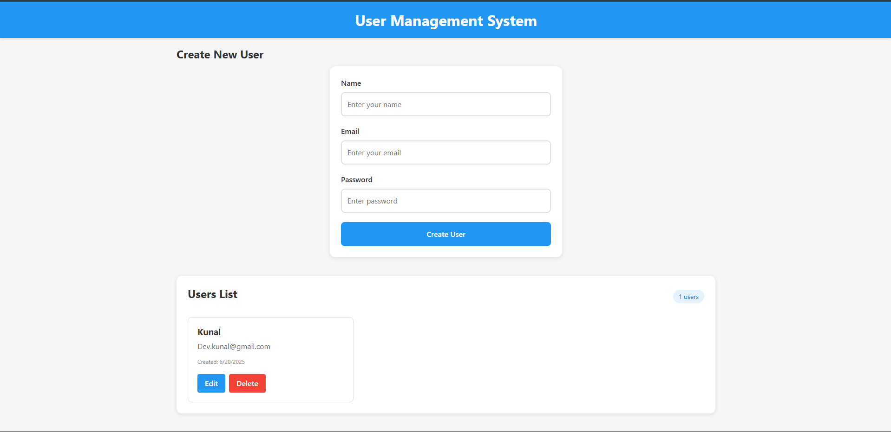

# Kunal API Server

A full-stack user management application built with TypeScript, React, Node.js, and SQLite.

## Application Screenshot



The application features a modern, responsive interface with:
- Clean user creation form
- User list with edit/delete functionality
- Real-time user count
- Material Design styling

## Features

- 🚀 Modern TypeScript/React frontend
- 🔒 Secure user authentication
- 📱 Responsive Material Design UI
- 🎯 RESTful API endpoints
- 🗄️ SQLite database with TypeORM
- ✨ CRUD operations for user management

## Project Structure

```
kunal-api-server/
├── frontend/          # React TypeScript frontend
├── backend/           # Node.js TypeScript backend
├── assets/           # Project assets and images
├── README.md         # Main documentation
└── API_DOCUMENTATION.md # API endpoints documentation
```

## Prerequisites

- Node.js (v14 or higher)
- npm or yarn
- TypeScript

## Quick Start

1. Clone the repository:
   ```bash
   git clone <repository-url>
   cd kunal-api-server
   ```

2. Start the backend:
   ```bash
   cd backend
   npm install
   npm start
   ```

3. Start the frontend:
   ```bash
   cd frontend
   npm install
   npm start
   ```

4. Open [http://localhost:3000](http://localhost:3000) in your browser

## Environment Variables

### Backend
- `PORT`: Server port (default: 5001)

### Frontend
- `REACT_APP_API_URL`: Backend API URL (default: http://localhost:5001/api)

## Development

- Backend runs on port 5001
- Frontend runs on port 3000
- SQLite database is created automatically

## Technologies Used

### Frontend
- React 18
- TypeScript
- Material Design
- Axios

### Backend
- Node.js
- Express
- TypeScript
- TypeORM
- SQLite

## Contributing

1. Fork the repository
2. Create your feature branch
3. Commit your changes
4. Push to the branch
5. Create a Pull Request

